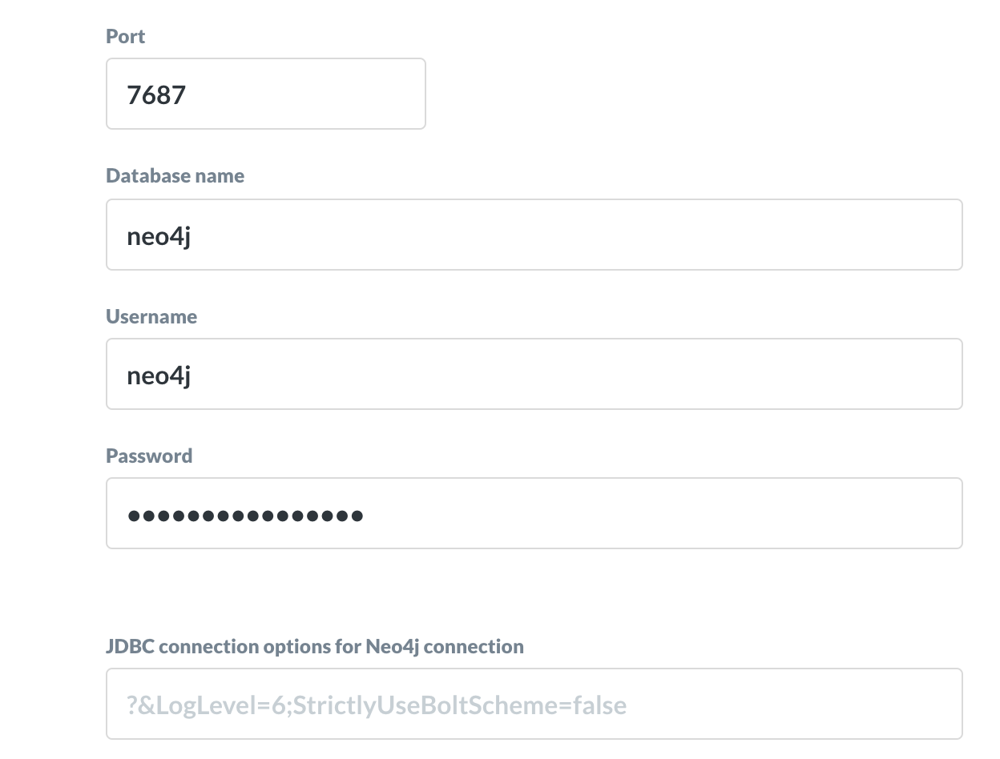

# Neo4j Metabase driver

Simple wrapper around the Neo4j BI connector for metabase.

## Building the driver

### Prerequisites

#### Install Metabase as a local maven dependency, compiled for building drivers

Clone the [Metabase repo](https://github.com/metabase/metabase)

```bash
cd /path/to/metabase_source
lein install-for-building-drivers
```

#### Download and install the Neo4j BI connector

* Get the connector [here](https://neo4j.com/bi-connector/)

```bash
# cp the jar to the maven dir
mkdir -p ~/.m2/repository/neo4j/neo4j-bi-jdbc/1.0.0 && cp JAR_PATH ~/.m2/repository/neo4j/neo4j-bi-jdbc/1.0.0/
```

### Build the driver

```bash
# (In the directory where you cloned this repository)
lein clean
DEBUG=1 LEIN_SNAPSHOTS_IN_RELEASE=true lein uberjar
```

### Copy it to your plugins dir and restart Metabase

```bash
mkdir -p /path/to/metabase/plugins/
cp target/uberjar/neo4j.metabase-driver.jar /path/to/metabase/plugins/
jar -jar /path/to/metabase/metabase.jar
```

*or:*

```bash
mkdir -p /path/to/metabase_source/plugins
cp target/uberjar/neo4j.metabase-driver.jar /path/to/metabase_source/plugins/
cd /path/to/metabase_source
lein run
```

## Working with a relational model on graphs

The JDBC driver exposes schemas for **Relationships** and **Nodes**

* Relationships

  * The driver creates one table for each distinct combination of source label, relationship type, and target label.

* Nodes
  * The driver only creates tables for nodes that have labels.
  * The driver creates one table for each distinct combination of node labels.
  
  Given
  * Node1, with the label [Alphabet]
  * Node2, with the label [Google]
  * Node3, with the labels[Alphabet,Google]
  
  The following tables will be created:
  * Alphabet
  * Google
  * Alphabet_Google

* Naming
Separators between node label names and relationship names is an underscore by default

To change the Node name seperator, you can use the LabelSeparator JDBC property, or RelNodeSeperator for Relationship tables.

JDBC properties can be added via the driver configuration as shown in the image below.

> For an up to date list of allowed configuration values, please download the [JDBC driver](https://neo4j.com/bi-connector/)



## Caveats

**This is a WIP.**

It is not heavily tested and is not compatible with neo4j 3.5 ( even though the underlying driver is )

## TODO

* Edge properties
* Timestamp casting support
* Testing
* CI

## Future

* Support Cypher extended queries as BI connector matures
* Cypher and graph viz for Metabase ( directly or via ad-hoc JDBC driver )