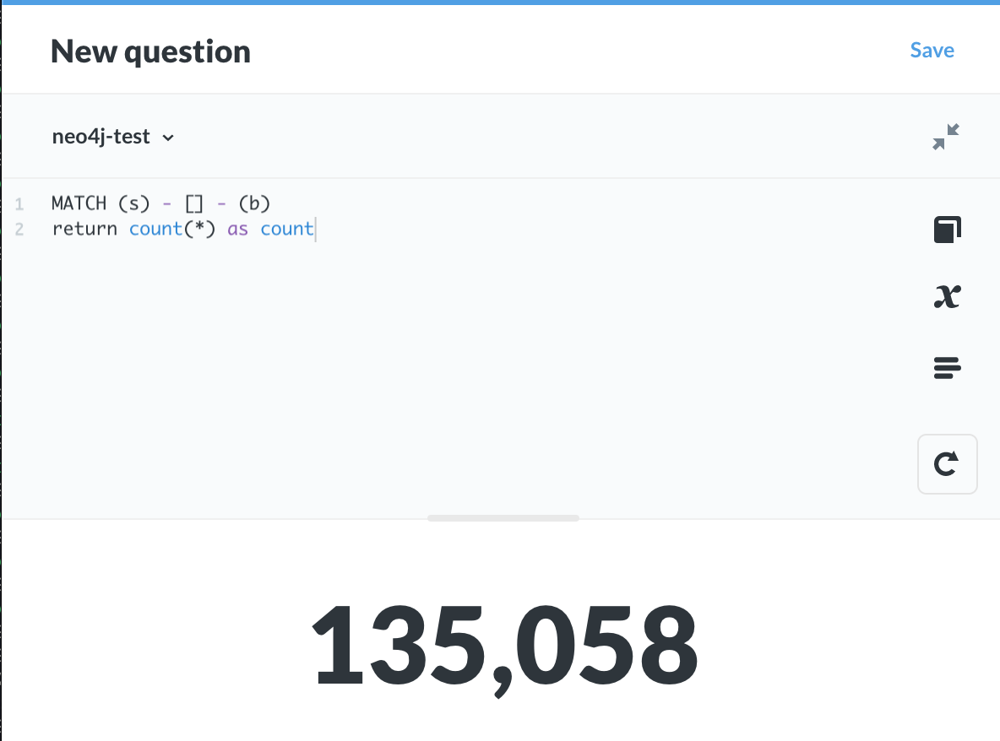

# Neo4j Metabase driver


[](https://github.com/bbenzikry/metabase-neo4j-driver/releases)
[](https://raw.githubusercontent.com/bbenzikry/metabase-neo4j-driver/master/LICENSE)

**SQL** and **Cypher** support for Neo4j on Metabase

<!-- markdownlint-disable MD033 -->
<div align="center">


</div>

## Neo4j Prerequisites
- Make sure your neo4j instance / cluster has [APOC](https://github.com/neo4j-contrib/neo4j-apoc-procedures) enabled.
> Without APOC, the underlying BI connector will not be usable. 
  For more information on the permission set required, download the [BI connector docs](https://neo4j.com/bi-connector/)

## Installation

### Run with Docker

```bash
git clone https://github.com/bbenzikry/metabase-neo4j-driver.git
cd metabase-neo4j-driver
docker build -t metabase/neo4j .
docker run --name metabase-neo4j -p 3000:3000 metabase/neo4j
```

### JAR installation

- Download the latest metabase version from [here](https://metabase.com/start/jar.html)
- Download the latest `neo4j.metabase-driver.jar` from the [releases](https://github.com/bbenzikry/metabase-neo4j-driver/releases) page
- Create a metabase folder and place your metabase.jar
- Copy neo4j.metabase-driver.jar to the `plugins/` folder
  ```bash
  .
  ├── metabase.jar
  └── plugins
      └── neo4j.metabase-driver.jar
  ```
- Run `java -jar metabase.jar`

## Using Cypher

- Cypher is currently only implemented for explicit querying
- All cypher queries must return column based results ( aggregation results or column values )
  

## Working with a relational model on graphs

The JDBC driver exposes schemas for **Relationships** and **Nodes**

- Relationships

  - The driver creates one table for each distinct combination of source label, relationship type, and target label.

- Nodes

  - The driver only creates tables for nodes that have labels.
  - The driver creates one table for each distinct combination of node labels.

  Given

  - Node1, with the label [Alphabet]
  - Node2, with the label [Google]
  - Node3, with the labels[Alphabet,Google]

  The following tables will be created:

  - Alphabet
  - Google
  - Alphabet_Google

- Naming
  Separators between node label names and relationship names is an underscore by default

To change the Node name seperator, you can use the LabelSeparator JDBC property, or RelNodeSeperator for Relationship tables.

JDBC properties can be added via the driver configuration as shown in the image below.

> For an up to date list of allowed configuration values, please download the [JDBC driver](https://neo4j.com/bi-connector/)


## Building the driver

### Prerequisites

#### Install Metabase as a local maven dependency, compiled for building drivers

Clone the [Metabase repo](https://github.com/metabase/metabase)

```bash
cd /path/to/metabase_source
lein install-for-building-drivers
```

#### Download and install the Neo4j BI connector

- Get the connector [here](https://neo4j.com/bi-connector/)

```bash
# cp the jar to the maven dir
mkdir -p ~/.m2/repository/neo4j/neo4j-bi-jdbc/1.0.0 && cp JAR_PATH ~/.m2/repository/neo4j/neo4j-bi-jdbc/1.0.0/
```

### Build the driver

```bash
# (In the directory where you cloned this repository)
lein clean
DEBUG=1 LEIN_SNAPSHOTS_IN_RELEASE=true lein uberjar
```

### Copy it to your plugins dir and restart Metabase

```bash
mkdir -p /path/to/metabase/plugins/
cp target/uberjar/neo4j.metabase-driver.jar /path/to/metabase/plugins/
jar -jar /path/to/metabase/metabase.jar
```

_or:_

```bash
mkdir -p /path/to/metabase_source/plugins
cp target/uberjar/neo4j.metabase-driver.jar /path/to/metabase_source/plugins/
cd /path/to/metabase_source
lein run
```

## Caveats

**This is a WIP.**

It is not heavily tested and is not compatible with neo4j 3.5 ( even though the underlying JDBC driver is )

## TODO

- ~~Edge properties~~
- ~~Timestamp casting support~~
- ~~Cypher support~~
- ~~Multiple database support~~
- ~~Metabase variable substitution~~ 
- Testing

- CI

## Future

- Support complex results in cypher ( e.g. non relational projections )
- Graph viz support

## Known issues

- Initial DB creation and/or sync may time out. You can configure a higher timeout value with the `MB_DB_CONNECTION_TIMEOUT_MS` environment variable.

- In a standalone neo4j installation, if you encounter the error below, use ``StrictlyUseBoltScheme=true`` in the JDBC options ( see: [#12](https://github.com/bbenzikry/metabase-neo4j-driver/issues/12) )
> \[Simba\] \[Neo4jJDBCDriver]\(100041) An error has occurred during data source connection: Failed to obtain connection towards READ server


<div align="center">
<sub><sup>Logos and images used in this document are licensed to their original creators and do not indicate any affiliation with this project</sup></sub>
</div>


